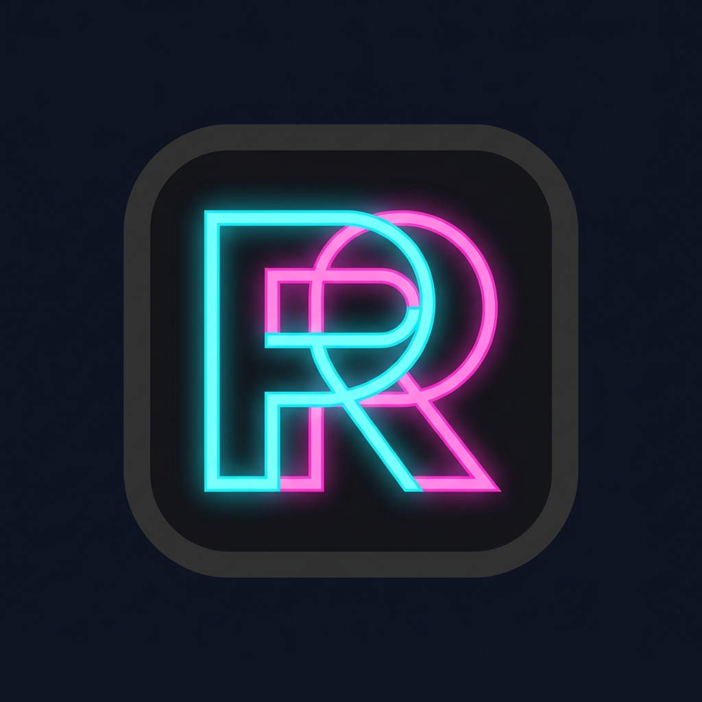

<div align="center">
  
  <h1>Roblox Elite Multi-Instance Launcher</h1>
  <p>Open-source Windows WPF application for securely launching and managing multiple Roblox clients with encryption and optimized process handling.</p>

[](https://dotnet.microsoft.com/)
[](#)
[](#)

</div>

---

## ✨ Features

### 🛡️ Multi-Instance Support

Allows running multiple Roblox clients simultaneously by handling process-level limitations safely.

### 🔒 Secure Cookie Storage

Uses Windows DPAPI (`ProtectedData`) to encrypt `.ROBLOSECURITY` tokens locally.

### 🚀 Auth Ticket System

Generates secure authentication tickets via official Roblox endpoints instead of exposing cookies.

### ⚡ Stable Launch System

Prevents crashes and conflicts during multi-launch scenarios with controlled file access.

### 🤖 AFK Automation

Optional background system that simulates mouse movement per window to prevent idle kick.

### 🎨 Clean UI

Minimal, responsive WPF interface inspired by modern IDE design.

---

## 🛠️ Setup & Build

1. Clone the repository:

   ```bash
   git clone https://github.com/mustafad2b2t/ProjeRoblox.git
   ```

2. Open with **Visual Studio 2022**

   * Open `RobloxMultiLauncher.sln`

3. Requirements:

   * .NET Framework 4.8
   * WPF Tools

4. Build:

   * Set configuration to `Release`
   * Press `Ctrl + B`

5. Run:

   * `bin/Release/RobloxMultiLauncher.exe`

---

## 📚 Quick Start

1. Click **+ Add Account**
2. Paste your `.ROBLOSECURITY` token
3. Enter the **Place ID**
4. Save account
5. Click **Launch All**

*(Optional)* Adjust delay and AFK settings in ⚙️ Settings panel.

---

## ⚠️ Disclaimer

This project is for educational purposes only.
The developers are not responsible for any account actions, restrictions, or misuse.

**Roblox is a trademark of Roblox Corporation.**
